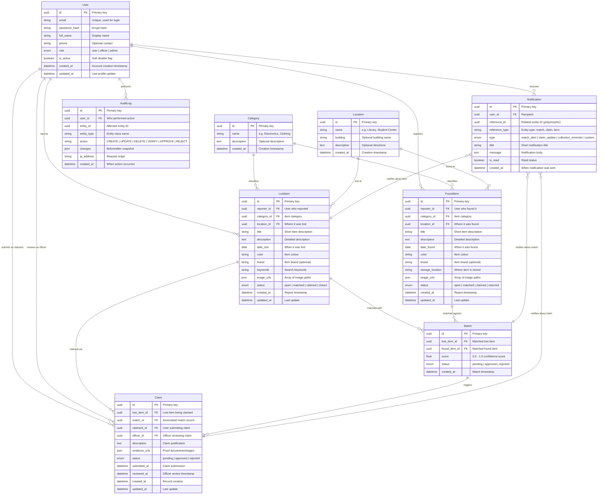

# 🗄️ TRACE — Entity Relationship Diagram

## Entity Summary

| Entity | Description | Key Attributes |
|---|---|---|
| **User** | All system actors (users, officers, admins) | email, role, password_hash |
| **LostItem** | Lost property reports | category, location, date_lost, status |
| **FoundItem** | Found property registrations | category, location, date_found, storage_location |
| **Category** | Item classification taxonomy | name, description |
| **Location** | Physical locations on campus | name, building |
| **Match** | Algorithmic pairing of lost↔found items | score, status |
| **Claim** | Ownership verification requests | evidence, status, officer |
| **Notification** | User alerts and system messages | type, message, reference_id, is_read |
| **AuditLog** | Immutable audit trail | action, changes, ip_address |

## Relationship Summary

- **User → LostItem/FoundItem** — One-to-many (a user can report multiple items)
- **Category → Items** — One-to-many (a category classifies many items)
- **Location → Items** — One-to-many (a location can have many items lost/found there)
- **LostItem ↔ FoundItem via Match** — Many-to-many resolved by Match join entity with score
- **Match → Claim** — One-to-many (a match can trigger verification claims)
- **User → Claim (dual)** — Users submit claims; officers review them
- **Notification → User** — Many-to-one (notifications belong to a user)
- **Notification → Match/Claim/Item** — Polymorphic (notifications reference different entity types via `reference_id`)
