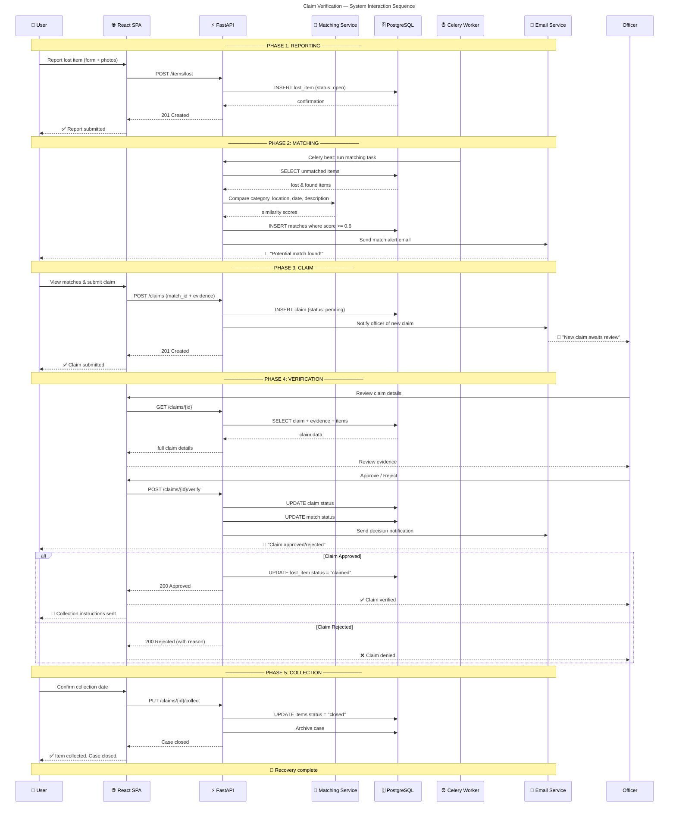
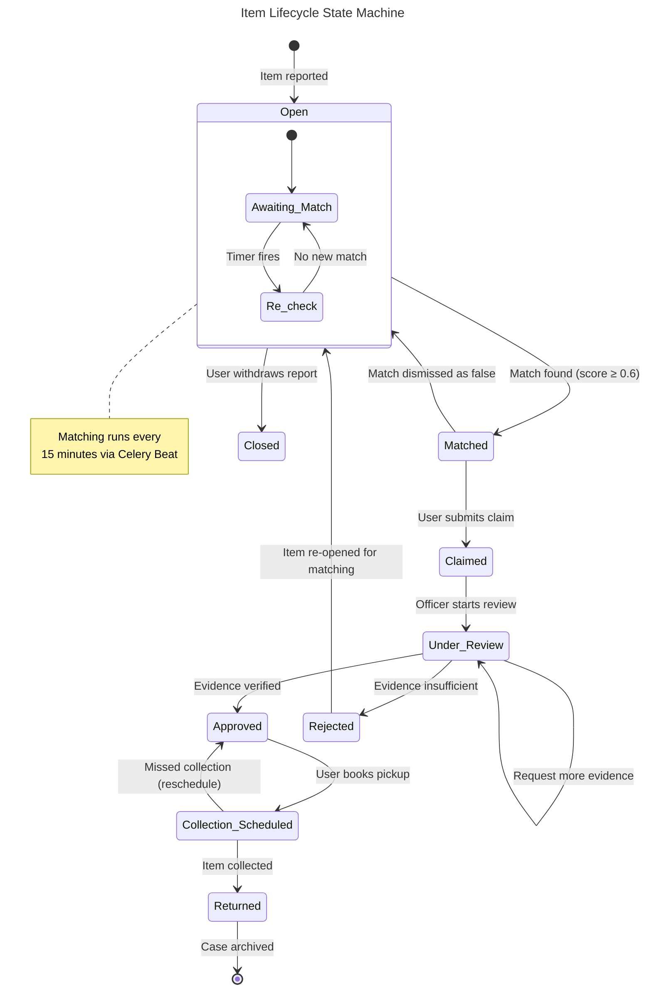

# 🔄 TRACE — Process Model

Two diagrams illustrating the TRACE business processes:

1. **Business Process Flowchart** — End-to-end lost item recovery workflow
2. **System Sequence Diagram** — Component interaction for the claim verification flow

---

## 1️⃣ Business Process Flowchart

```mermaid
---
title: Lost Item Recovery Process
---
%%{init: {'theme': 'base', 'themeVariables': {
    'primaryColor': '#d5e8d4',
    'primaryTextColor': '#000',
    'primaryBorderColor': '#82b366',
    'lineColor': '#36393d',
    'secondaryColor': '#fff2cc',
    'tertiaryColor': '#f8cecc'
}}}%%

flowchart TB
    %% ============================================================
    %% START
    %% ============================================================
    START(["🔵 Item Lost or Found"])

    %% ============================================================
    %% PARALLEL TRACKS — REPORTING
    %% ============================================================

    %% Lost track
    LOST_REPORT["📝 User reports lost item<br/><i>fills form + photos</i>"]
    LOST_STORE["💾 System saves LostItem<br/>status: open"]
    LOST_USER_NOTE["👤 User notified: report submitted"]

    %% Found track
    FOUND_REPORT["📝 User/Officer reports found item<br/><i>fills form + storage location</i>"]
    FOUND_STORE["💾 System saves FoundItem<br/>status: open"]
    FOUND_USER_NOTE["👤 User/Officer notified: item registered"]

    %% ============================================================
    %% DUPLICATE CHECKS (independent per item type)
    %% ============================================================

    CHECK_LOST_DUP{"🔍 Check lost duplicates<br/>similar lost report?"}
    CHECK_FOUND_DUP{"🔍 Check found duplicates<br/>similar found report?"}
    DUP_YES_LOST["⚠️ Alert user: similar lost report exists"]
    DUP_YES_FOUND["⚠️ Alert user: similar found report exists"]
    DUP_NO["✅ Proceed with matching"]

    %% ============================================================
    %% MATCHING ENGINE
    %% ============================================================

    TRIGGER_MATCH["⏰ Celery scheduled task: run matching"]
    MATCH_ENGINE["⚙️ Matching Algorithm<br/><i>Category + Location + Date + Description</i>"]
    MATCH_SCORE["📊 Calculate confidence score<br/>0.0 — 1.0"]

    DECIDE_MATCH{"🎯 Score ≥ threshold?"}
    HIGH_MATCH["✅ Match found<br/>Create Match record"]
    LOW_MATCH["❌ No strong match<br/>Keep items open"]

    SAVE_MATCH["💾 Save Match(status: pending)"]
    NOTIFY_USER["📧 Send match alert notification to user"]

    %% ============================================================
    %% CLAIM WORKFLOW
    %% ============================================================

    VIEW_MATCH["👤 User views potential matches"]
    DECIDE_CLAIM{"📋 User wants to claim?"}
    NO_CLAIM["⏸ Item remains open<br/>for future matching"]
    SUBMIT_CLAIM["📝 User submits ownership claim<br/>+ uploads evidence"]
    SAVE_CLAIM["💾 Save Claim(status: pending)"]
    NOTIFY_OFFICER["📧 Notify officer: new claim to review"]

    DECIDE_APPROVE{"🛡 Officer reviews evidence<br/><i>description match?<br/>photos match?<br/>proof adequate?</i>"}
    REJECT["❌ Reject claim<br/>Notify user"]
    APPROVE["✅ Approve claim<br/>Update Match(status: approved)"]

    SCHEDULE_COLLECT["📅 Schedule item collection"]
    NOTIFY_COLLECT["📧 Send collection details to user"]
    COLLECT["🏆 User collects item<br/>Case closed!"]

    ARCHIVE["📦 Archive case<br/>Update stats"]

    %% ============================================================
    %% EDGES — FLOW
    %% ============================================================

    START --> LOST_REPORT
    START --> FOUND_REPORT

    LOST_REPORT --> LOST_STORE
    FOUND_REPORT --> FOUND_STORE

    LOST_STORE --> CHECK_LOST_DUP
    FOUND_STORE --> CHECK_FOUND_DUP

    CHECK_LOST_DUP -->|"Duplicate found"| DUP_YES_LOST
    CHECK_LOST_DUP -->|"Unique"| DUP_NO
    CHECK_FOUND_DUP -->|"Duplicate found"| DUP_YES_FOUND
    CHECK_FOUND_DUP -->|"Unique"| DUP_NO

    DUP_YES_LOST -->|"User proceeds anyway"| DUP_NO
    DUP_YES_FOUND -->|"User proceeds anyway"| DUP_NO

    DUP_NO --> TRIGGER_MATCH
    LOST_STORE -.-> TRIGGER_MATCH
    FOUND_STORE -.-> TRIGGER_MATCH

    TRIGGER_MATCH --> MATCH_ENGINE
    MATCH_ENGINE --> MATCH_SCORE

    MATCH_SCORE --> DECIDE_MATCH

    DECIDE_MATCH -->|"Score ≥ 0.6"| HIGH_MATCH
    DECIDE_MATCH -->|"Score < 0.6"| LOW_MATCH

    HIGH_MATCH --> SAVE_MATCH
    SAVE_MATCH --> NOTIFY_USER

    NOTIFY_USER --> VIEW_MATCH
    LOW_MATCH -.->|"Re-run when new items arrive"| TRIGGER_MATCH

    VIEW_MATCH --> DECIDE_CLAIM
    DECIDE_CLAIM -->|"Not now"| NO_CLAIM
    DECIDE_CLAIM -->|"Yes, it's mine"| SUBMIT_CLAIM

    SUBMIT_CLAIM --> SAVE_CLAIM
    SAVE_CLAIM --> NOTIFY_OFFICER

    NOTIFY_OFFICER --> DECIDE_APPROVE

    DECIDE_APPROVE -->|"Evidence insufficient"| REJECT
    DECIDE_APPROVE -->|"Evidence verified ✓"| APPROVE

    APPROVE --> SCHEDULE_COLLECT
    SCHEDULE_COLLECT --> NOTIFY_COLLECT
    NOTIFY_COLLECT --> COLLECT
    COLLECT --> ARCHIVE

    REJECT --> NO_CLAIM

    %% ============================================================
    %% STYLING
    %% ============================================================

    classDef process fill:#d5e8d4,stroke:#82b366,stroke-width:2px;
    classDef decision fill:#fff2cc,stroke:#d6b656,stroke-width:2px;
    classDef terminal fill:#f8cecc,stroke:#b85450,stroke-width:2px;
    classDef storage fill:#e1d5e7,stroke:#9673a6,stroke-width:2px;
    classDef notify fill:#dae8fc,stroke:#6c8ebf,stroke-width:2px;
    classDef startend fill:#f5f5f5,stroke:#666666,stroke-width:2px;

    class LOST_REPORT,FOUND_REPORT,SUBMIT_CLAIM,SCHEDULE_COLLECT,VIEW_MATCH process;
    class CHECK_DUP,DECIDE_MATCH,DECIDE_CLAIM,DECIDE_APPROVE decision;
    class LOST_STORE,FOUND_STORE,SAVE_MATCH,SAVE_CLAIM storage;
    class NOTIFY_USER,NOTIFY_OFFICER,NOTIFY_COLLECT notify;
    class START,COLLECT,ARCHIVE startend;
    class REJECT,NO_CLAIM,LOW_MATCH terminal;
```

## 2️⃣ System Sequence Diagram — Claim Verification

## Process States — State Machine

## Workflow Summary

| Phase | Trigger | Actor | System Action |
|---|---|---|---|
| **1. Reporting** | Lost/found event | User/Officer | Save item, check duplicates |
| **2. Matching** | Scheduled task (Celery Beat) | System | Algorithmic scoring, notification |
| **3. Claim** | User views match | User | Submit evidence, notify officer |
| **4. Verification** | Officer reviews | Officer | Approve/reject, update statuses |
| **5. Collection** | Approval granted | User + Officer | Schedule pickup, archive case |
