# 🎯 TRACE — Use Case Diagram

```mermaid
---
title: TRACE Lost & Found System — Use Case Diagram
---
%%{init: {'theme': 'base', 'themeVariables': {
    'actorBorder': '#36393d',
    'actorTextColor': '#000000',
    'useCaseBorder': '#d79b00',
    'useCaseBackground': '#fff2cc',
    'textColor': '#000000',
    'lineColor': '#36393d'
}}}%%

graph TB
    %% ============================================================
    %% ACTORS
    %% ============================================================

    User["<b>👤 User</b><br/><i>Regular end user</i>"]
    Officer["<b>🛡 Officer</b><br/><i>Lost & Found staff</i>"]
    Admin["<b>👨‍💼 Administrator</b><br/><i>System admin</i>"]
    System["<b>⚙️ System</b><br/><i>Automated processes</i>"]

    %% ============================================================
    %% USE CASES — AUTHENTICATION
    %% ============================================================

    subgraph AUTH["🔐 Authentication & Profile"]
        UC1("[UC-1] Register Account")
        UC2("[UC-2] Login / Logout")
        UC3("[UC-3] Reset Password")
        UC4("[UC-4] Update Profile")
    end

    %% ============================================================
    %% USE CASES — REPORTING
    %% ============================================================

    subgraph REPORT["📝 Item Reporting"]
        UC5("[UC-5] Report Lost Item")
        UC6("[UC-6] Report Found Item")
        UC7("[UC-7] Upload Item Photos")
        UC8("[UC-8] Edit / Cancel Report")
        UC9("[UC-9] View My Reports")
    end

    %% ============================================================
    %% USE CASES — MATCHING
    %% ============================================================

    subgraph MATCH["🔗 Intelligent Matching"]
        UC10("[UC-10] Run Matching Algorithm")
        UC11("[UC-11] View Potential Matches")
        UC12("[UC-12] Acknowledge Match")
        UC13("[UC-13] Dismiss False Match")
    end

    %% ============================================================
    %% USE CASES — CLAIMS
    %% ============================================================

    subgraph CLAIM["📋 Claims & Verification"]
        UC14("[UC-14] Submit Ownership Claim")
        UC15("[UC-15] Upload Evidence")
        UC16("[UC-16] Review Claim")
        UC17("[UC-17] Approve / Reject Claim")
        UC18("[UC-18] Track Claim Status")
        UC19("[UC-19] Schedule Item Collection")
    end

    %% ============================================================
    %% USE CASES — MANAGEMENT
    %% ============================================================

    subgraph MGMT["⚙️ Administration"]
        UC20("[UC-20] Manage Users")
        UC21("[UC-21] Manage Categories")
        UC22("[UC-22] Manage Locations")
        UC23("[UC-23] Configure System Settings")
        UC24("[UC-24] View Audit Logs")
    end

    %% ============================================================
    %% USE CASES — REPORTING & DASHBOARD
    %% ============================================================

    subgraph DASH["📊 Reports & Analytics"]
        UC25("[UC-25] View Dashboard")
        UC26("[UC-26] Generate Recovery Report")
        UC27("[UC-27] Export Statistics")
        UC28("[UC-28] View Activity Timeline")
    end

    %% ============================================================
    %% USE CASES — NOTIFICATIONS
    %% ============================================================

    subgraph NOTIFY["🔔 Notifications"]
        UC29("[UC-29] Send Match Alert")
        UC30("[UC-30] Send Claim Update")
        UC31("[UC-31] Send Collection Reminder")
        UC32("[UC-32] Manage Notification Preferences")
    end

    %% ============================================================
    %% ACTOR -> USE CASE CONNECTIONS
    %% ============================================================

    %% User connections
    User --> UC1
    User --> UC2
    User --> UC3
    User --> UC4
    User --> UC5
    User --> UC6
    User --> UC7
    User --> UC8
    User --> UC9
    User --> UC11
    User --> UC13
    User --> UC14
    User --> UC15
    User --> UC18
    User --> UC19
    User --> UC32

    %% Officer connections
    Officer --> UC2
    Officer --> UC8
    Officer --> UC12
    Officer --> UC16
    Officer --> UC17
    Officer --> UC19
    Officer --> UC22

    %% Admin connections
    Admin --> UC2
    Admin --> UC20
    Admin --> UC21
    Admin --> UC23
    Admin --> UC24
    Admin --> UC25
    Admin --> UC26
    Admin --> UC27
    Admin --> UC28

    %% System connections (automated)
    System --> UC10
    System --> UC11
    System --> UC29
    System --> UC30
    System --> UC31

    %% ============================================================
    %% INCLUDE / EXTEND RELATIONSHIPS
    %% ============================================================

    UC5 -.-> UC7
    UC6 -.-> UC7
    UC14 -.-> UC15
    UC17 -.-> UC16
    UC25 -.-> UC26
    UC26 -.-> UC27
```

## Actor Summary

| Actor | Role | Responsibility |
|---|---|---|
| **👤 User** | Regular end user | Report lost/found items, submit claims, track status |
| **🛡 Officer** | Lost & Found staff | Verify reports, review claims, manage collections |
| **👨‍💼 Admin** | System administrator | Manage users/categories, generate reports, configure |
| **⚙️ System** | Automated processes | Run matching algorithm, send notifications |

## Use Case Inventory

| ID | Use Case | Actor(s) | Description |
|---|---|---|---|
| UC-1 | Register Account | User | Create a new user account |
| UC-2 | Login / Logout | User, Officer, Admin | Authenticate into the system |
| UC-3 | Reset Password | User | Recover forgotten password |
| UC-4 | Update Profile | User | Edit personal profile details |
| UC-5 | Report Lost Item | User | Submit a lost item report |
| UC-6 | Report Found Item | User | Register a found item |
| UC-7 | Upload Item Photos | User | Attach images to a report |
| UC-8 | Edit / Cancel Report | User, Officer | Modify or withdraw a report |
| UC-9 | View My Reports | User | List personal reports |
| UC-10 | Run Matching Algorithm | System | Match lost ↔ found items |
| UC-11 | View Potential Matches | User | See matched items |
| UC-12 | Acknowledge Match | Officer | Confirm a match is valid |
| UC-13 | Dismiss False Match | User | Reject an incorrect match |
| UC-14 | Submit Ownership Claim | User | Claim ownership of matched item |
| UC-15 | Upload Evidence | User | Attach proof of ownership |
| UC-16 | Review Claim | Officer | Examine claim evidence |
| UC-17 | Approve / Reject Claim | Officer | Finalize claim decision |
| UC-18 | Track Claim Status | User | Monitor claim progress |
| UC-19 | Schedule Collection | User, Officer | Arrange item pickup |
| UC-20 | Manage Users | Admin | CRUD user accounts |
| UC-21 | Manage Categories | Admin | Maintain item categories |
| UC-22 | Manage Locations | Admin, Officer | Maintain location data |
| UC-23 | Configure System | Admin | System-wide settings |
| UC-24 | View Audit Logs | Admin | Review system activity |
| UC-25 | View Dashboard | Admin | Analytics overview |
| UC-26 | Generate Report | Admin | Recovery statistics |
| UC-27 | Export Statistics | Admin | Data export |
| UC-28 | View Timeline | Admin | Activity feed |
| UC-29 | Send Match Alert | System | Notify user of match |
| UC-30 | Send Claim Update | System | Notify claim status change |
| UC-31 | Send Reminder | System | Collection reminder |
| UC-32 | Manage Preferences | User | Notification settings |
